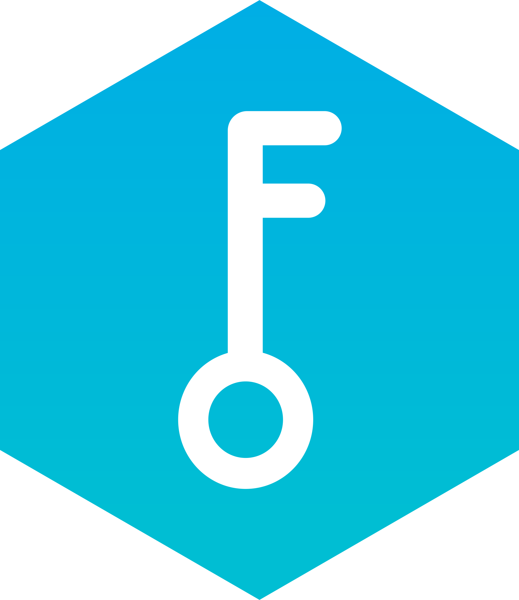

<a>
    
</a>

Chaveiro Smart Rest API
======================

O seguinte repositório contém uma API Rest para o projeto Chaveiro Smart.

A API foi desenvolvida com TypeScript e NodeJS, utilizando algumas tecnologias, incluindo:

 - TypeORM
 - class-validator
 - express
 - helmet
 - JWT
 - argon2
 - Docker


## Sumário

* [Chaveiro Smart Rest API](#chaveiro-smart-rest-api)
    * [Variáveis de Ambiente](#variáveis-de-ambiente)
    * [MySQL](#mysql)
    * [Instalação](#instalação)
    * [Migrations](#migrations)
    * [Execução em Desenvolvimento: ts-node-dev](#execução-em-desenvolvimento-ts-node-dev)
    * [Execução em Produção: Docker](#execução-em-produção-docker)
    * [Raspberry Pi](#raspberry-pi)
    * [Entidades](#entidades)
    * [Rotas](#rotas)
        * [Autenticação](#autenticação)
        * [Usuários](#usuários)
        * [Funcionários](#funcionários)
        * [Motor](#motor)
        * [Chaves](#chaves)
        * [Requisições](#requisições)


## Variáveis de Ambiente

Antes da execução da API é necessário incluir um arquivo `.env` na raiz do diretório, um exemplo `.env.sample` foi incluído e deve ser usado como base.


## MySQL

Também é necessário modificar o arquivo `orm.config.json` com as credenciais do banco de dados instalado:

```json
{
    ...
    "type": "mysql",
    "host": "localhost",
    "port": 3306,
    "username": "USERNAME",
    "password": "PASSWORD",
    "database": "DATABASE_NAME",
    ...
}
```


## Instalação

Primeiramente na raiz do repositório instale as dependências do NodeJS com o comando:

```bash
>> npm install
```


## Migrations

```bash
>> npm run typeorm:migration 
```


## Execução em Desenvolvimento: ts-node-dev

Para iniciar a API em modo de desenvolvimento, execute:

```bash
>> npm run dev 
```


## Execução em Produção: Docker

Para a execução em modo de produção um container docker pode ser criado, para tal na raiz do repositório execute:

```bash
>> docker-compose up --build 
```
Após o comando algumas imagens serão baixadas e os containers serão construídos e executados.
Foram inclusas as imagens do `mysql:5.7` e `phpmyadmin`, que podem ser retiradas com a edição do arquivo `docker-compose.yml` conforme desejado.


## Raspberry Pi

Para a execução no Raspberry Pi é necessário instalar os pacotes do docker, para tal execute:

```bash
>> sudo apt-get install docker docker-compose 
```

No diretório desejado clone o repositório:

```bash
>> git clone https://github.com/Asimovjr/chaveiro-smart-rest-api.git
```

Troque para branch `feature/raspberry-pi`:

```bash
>> git checkout feature/raspberry-pi
```

Crie os containers docker:

```bash
>> docker-compose up --build
```

Entre no container:

```bash
>> docker exec -it chaveiro-smart-rest-api_api_1 /bin/sh
```

Execute as migrations:

```bash
>> npm run typeorm:migration
```


## Entidades

<a>
    
</a>


## Rotas

### Autenticação


```json
{
    "username": "user",
    "password": "password"
}
```


```json
{
    "username": "user",
    "password": "password"
}
```


```json
{
    "username": "username",
    "oldPassword": "password",
    "newPassword": "newPassword"
}
```


### Usuários


```json
{
    "username": "new-username"
}
```


### Funcionários


```json
{
	"name": "name",
	"sector": "sector"
}
```


```json
{
	"name": "new-name",
	"sector": "new-sector"
}
```


### Motor


```json
{
	"position": 0
}
```


### Chaves


```json
{
	"id": 1,
	"available": true
}
```


```json
{
	"available": false
}
```


### Requisições


```json
{
	"id_key": 1,
	"employee": {
		"id": "b081c0c1-42d2-4812-b704-974b4949d5b2"
	},
	"action": true
}
```


